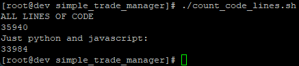
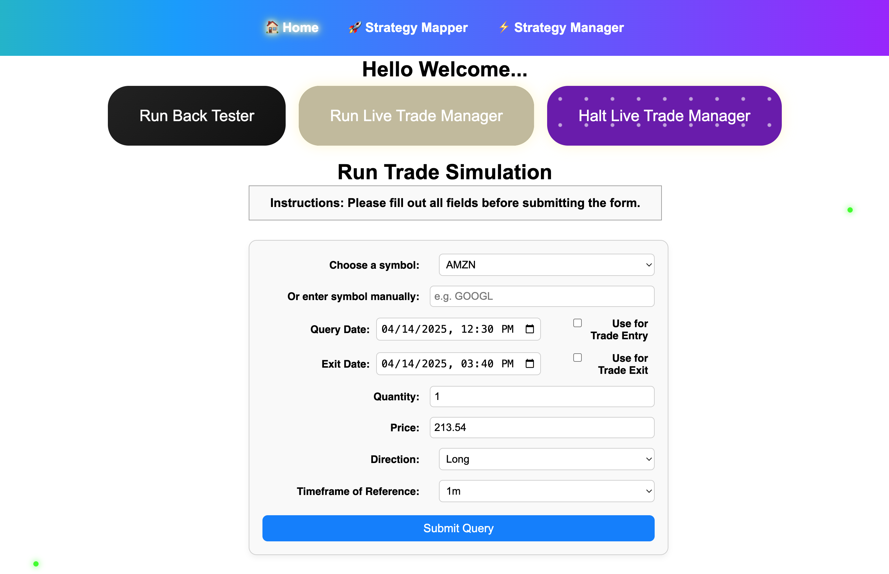
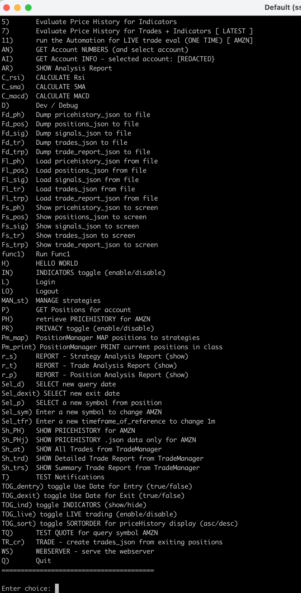
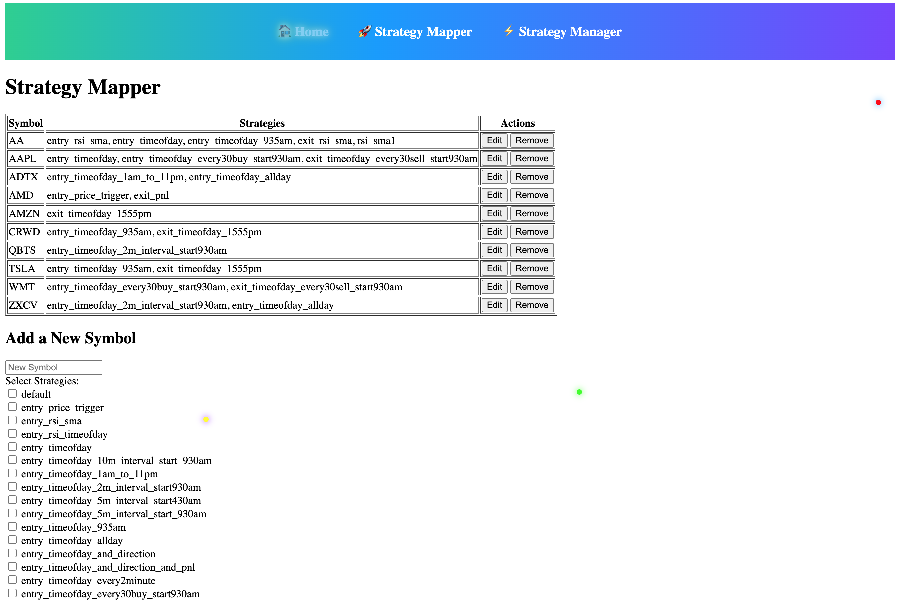
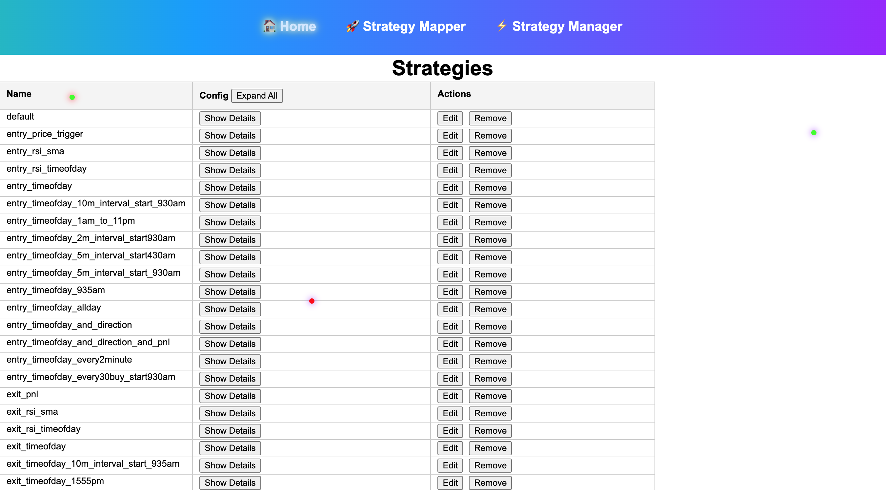
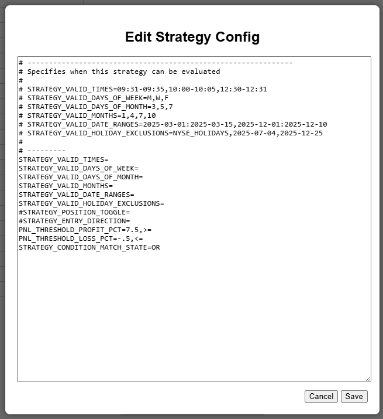
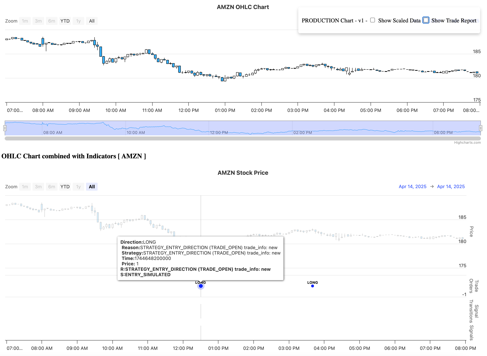
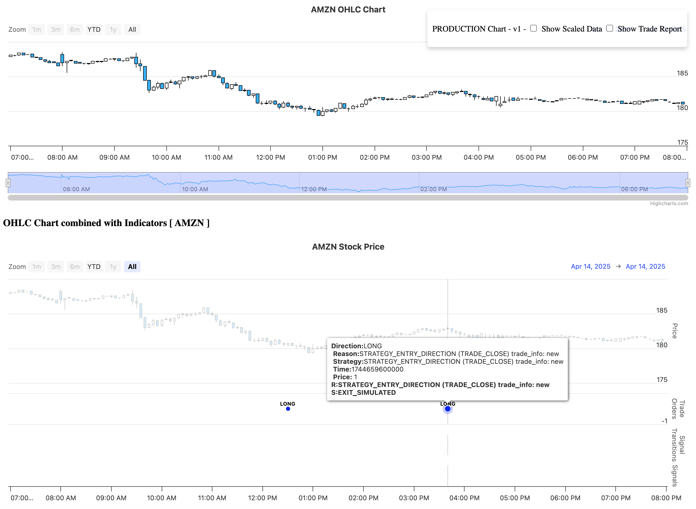
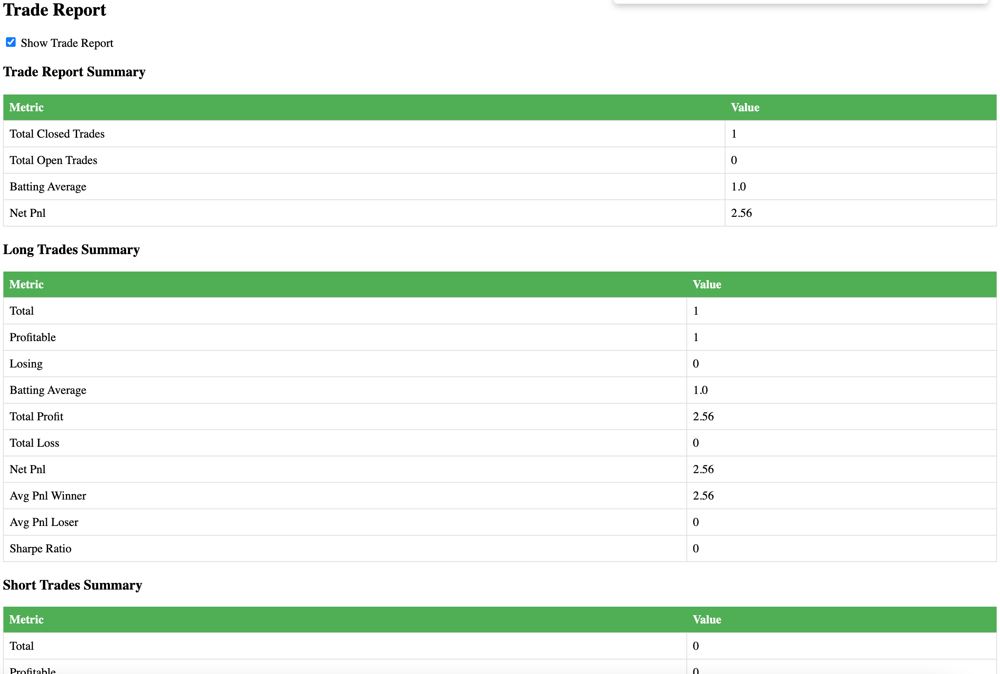

# Single Trade Manager and Backtester

Documentation forthcoming.

[](https://www.stockmarketswizzles.com)

##### Disclaimer:

The information on this page is for informational purposes only.  There are inherent risks to trading.  By trading you assume those risks.  The authors assuage responsibility for trading decisions that you may, or may not, make based on any information derived from the works within these pages.


##### Where do I get the code?

The intent is for a collaborative effort on development and feedback at this stage.

This is done via a private repo, and access can be granted for collaborators and interested 3rd parties.

Get in touch via: [ TBD if you do not have contact ] [ at the moment ] [ Discord is best ]

# Requirements

* schwab-py
* Flask
* python3

# Installation

The hope is to be able to run:

```

pip install -r requirements.txt

```

May or may not work.

# Screenshots

#### Main Interface

The main interface is where the entry point of the application is.

- Backtester
- Live trade Manager
- Stop Live trade manager

[](https://www.stockmarketswizzles.com)

#### CLI Interface

A command-line interface which allows operations of the underpinnings.

<a href="https://www.stockmarketswizzles.com">
  
</a>

#### Strategy Mapper

Use this interface to assign strategy or strategies to symbols.

[](https://www.stockmarketswizzles.com)


#### Strategy Manager

Use this interface to add/edit/delete/and re-factor and iterate on a strategy or strategies.

[](https://www.stockmarketswizzles.com)

#### Strategy Configuration Language Model

A flexible language model for describing trade signals including:

- Time of Day Entry / Exit
- Price point Entry / Exit
- Indicator Signals Entry / Exit

Signals may be evaluated on an [ AND | OR ] basis, meaning an "ALL or ANY" evaluation.

[](https://www.stockmarketswizzles.com)


# Screenshots of Vizualizations

Single Trade Manager is designed to work and output data compatible with a visualization layer to see entry / exit signals and technical indicator signals on an OHLCV chart.

### Entry Signal

##### Entry signal triggers at 12:30pm EST (according to parameters set from the **main Interface**)

These parmeters are tunable and vary according to the assigned strategy.

[](https://www.stockmarketswizzles.com)

### Exit Signal

##### Exit signal triggers at 3:40pm EST (according to parameters set from the **main Interface**)

These parmeters are tunable and vary according to the assigned strategy.

[](https://www.stockmarketswizzles.com)


### Trade Report

A trade report which shows basic statistics including batting-average, PnL, and # of trades.

[](https://www.stockmarketswizzles.com)
