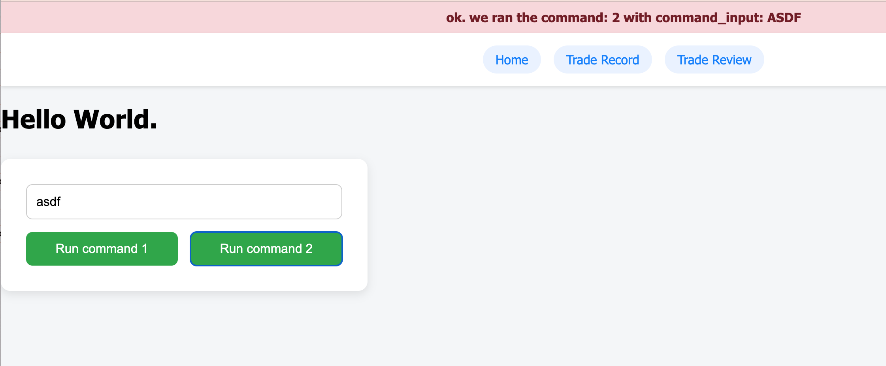
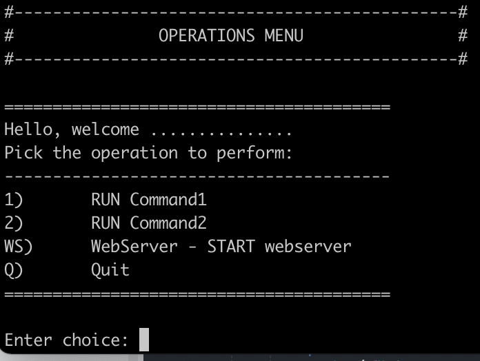

# INTRODUCTION

In the end, after this book is completed, you will have
a framework which:

Will allow historical review of a strategy to determine behavior of the automation
Will have a live robot which monitors the us stock market for one symbol in order
to make trade decisions on that symbol.
Have a visualization layer which shows analytical output.

Basically, a trading bot.

And a system to examine, review, adjust, tweak, and monitor the behavior of the bot.

Most importantly that.


Along with this comes a comprehensive set of tools , and the ability to understand
the tools so they may be customized, or expanded upon, as you, yourself see fit.

Now that you are officially stepping into the "programmers role" the future is within
your fingertips, Literally!

Happy typing.


# CHAPTER 1

## CLI and Setup

The intention here is to write a book, and use Markdown as the language in to write
the first draft.  Included here is code, and code examples.

And I get to do a lot of typing.  Which I love.  I love typing.  Ever since a kid,
I loved typing away on the keyboard, and so thus was a partial tool born which I
utilized to operate the computer keyboard.  That's enough background to say, in the
words of famous quarterback Patrick Mahomes "who you callin' a kid?"

Okay, let us get on with it.

### Chapter 1

The art of programming is not complex.  Rather, it is fairly the exact opposite.  It
is simplex.  Meaning singular.  Or singular in solution.  The solution for you, will
be a singular one.  One which you create for yourself out of code.  The journey is
straightforward!  Given some helpful guidance.  

Let us begin.

#### Helper scripts

Helper scripts are scripts which help abstract some of the mundane detail of
parameter passing, and remembering setups for starting or manipulating the 
application while in the development phase.


`# run.sh`


```

#!/usr/bin/env bash

SCRIPT="client.py"
python3 ${SCRIPT}

```

Make sure this script is executible by the Operating System (OS).  On linux:

```

chmod +x run.sh

```

#### Create the folder structure.

From now on, your code will always be highly organized.  No more "where do the files go" stuff.
Choose a meaningful folder structure which may or may not lay out with any pre-set standards.
It will help as you go to start small, not creating too many folders for things until you have
a true need for another level.

```

[ insert what is in  DOCUMENTATIONS.md when done ]

```


#### '__init__.py'

What is this file and why is it needed?  Do we ever need to put anything in here?  This
'__init__.py' file tells the compiler that code in this directory should be considered
for import using an 'import' statement or 'from * import' statement.


#### Stub out our file structure

# client.py

```

```

# main_logic.py

```


```


The goal at this point is to get something working.  Akin to seeing that first sparkplug
fire, this is the first goal.  To get our simplistic framework up and running.


From main logic we import a couple functions:

```

from core.main_logic import (
    init,
    displayStatus,
    displayMenu,
    processCommand,
    shutdown,
)

```

These are basic functions for running the CLI.  Mainly, client.py deals with working with the
CLI interface.  


Kind of some mental notes as we proceed:

```
import traceback
```

This module is included so that *when* there is an error (notice I said *when* not *if*) there is an error we can easily see what line of code and what the problem is by printing out a stacktrade.

We also, to have a comprehensive framework import the following:

```
server_launcher
web_client
```

The 'server_launcher' is an important abstraction layer which will be talked about in a moment.
It assists us to encapsulate the global namespace and allow access to the 'runServer()' command
which runs the web_client.

We will get into dependency loops in a moment, but this practice (including 'server_launcher') gets us around one of those dependency loops.


Okay, for the beginning, there is just a whole lot of coding going on.  There is not really 
a good way to encapsulate this down, and make it smaller, and still have it all "work."  So,
we build out the CLI and web interface, along with the 'run-time structure' , meaning "how
are we going to iterate and run the code over-and-over again during the development lifecycle.


# site.js

```
def onClick_runCommand1() {
    console.log("onClick_runCommand1");
}

def onClick_runCommand2() {
    console.log("onClick_runCommand2");
}
```

We start with the basics, in order to know that our web-interface is okay.  Open up the console
and watch the console log output to ensure these commands are running before proceeding.


At this point, this is what our index.html should look like:

```

<!DOCTYPE html>
<html>
<head>
    <link rel="stylesheet" href="{{ url_for('static', filename='css/site.css') }}">
    <link rel="stylesheet" href="{{ url_for('static', filename='css/navigation.css') }}">
    
    <script src="{{ url_for('static', filename='js/site.js') }}"></script>
</head>
<body>


<h1>Hello World.</h1>
<button onClick="onClick_runCommand('1')">Run command 1</button>
<button onClick="onClick_runCommand('2')">Run command 2</button>

</body>
</html>

```

Great, this is logging output to the console.

The only real web-code we have working right now is this:

```
function onClick_runCommand(command) {
    console.log("onClick_runCommand: " + command);
}

```

which does nothing.  Let's get this working!


### Flask and Routes

Flask is a python library which runs an internal webserver in Python.  There is a templating
engine, as well as some basic structure that we gain by using Flask as our webserver.

#### URI structure

A URI (or universal resource indicator) is what you may also know of as a "URL".  A
Url is a "universal resource locattor".  The URI is more comprehensive in that the
URI contains information about the protocol being spoken.  In 99% of the cases you
are familiar with, this protocol will be "HTTP" or "HTTPS" (secure HTTP).

A 'route' in Flask corresponds with an exact URI in the users web-browser.

The 'route':

```
https://myserver:8001/
```
is very much different than the route:
```
http://myserver:8001/watchlists/
```
for example.  As if that is not obvious enough, but the computer thinks so to!  And thus it gains us the advantage of doing different things for different routes.  Let's go setup two new pages now, which
will serve as our basic framework for the site.  In total we will have three routes:

- Home page
- Page 1
- Page 2


### Adding an API route

Often times there are requests that we want our backend server to handle which have nothing to do with web pages.  These are API requests.  In order to send API requests to our server, we setup an API
endpoint.  We will use '/api/v1/' as our chosen API endpoint.

It is often times wise to include version number with any RESTful API endpoint to allow for , yup! You guessed it!  Expansion.

Let's create our two new pages:

- Strategy Mapper
- Strategy Manager

Soon enough, we will be doing almost all backend code work, so enjoy the time you have for instant feedback through the web-browser interface.  We are about to step it up a notch.

Create two new template files:

- templates/strategy_mapper.html
- templates/strategy_manager.html


Updated 'navigation.html'

```
<div id="navigation">
    <a href="/">Home</a> |
    <a href="/trade_record">Trade Record</a> |
    <a href="/trade_review">Trade Review</a>
</div>
```

corresponding web-pages:

`trade_record.html`


```
<!DOCTYPE html>
<html>
<head>
    <link rel="stylesheet" href="{{ url_for('static', filename='css/site.css') }}">
    <link rel="stylesheet" href="{{ url_for('static', filename='css/navigation.css') }}">
    
    <script src="{{ url_for('static', filename='js/site.js') }}"></script>
    <script src="{{ url_for('static', filename='js/trade_record.js') }}"></script>
</head>
<body>


<h1>Trade Record</h1>

</body>
</html>
```

`trade_review.html`

```
<!DOCTYPE html>
<html>
<head>
    <link rel="stylesheet" href="{{ url_for('static', filename='css/site.css') }}">
    <link rel="stylesheet" href="{{ url_for('static', filename='css/navigation.css') }}">
    
    <script src="{{ url_for('static', filename='js/site.js') }}"></script>
    <script src="{{ url_for('static', filename='js/trade_review.js') }}"></script>
</head>
<body>


<h1>Trade Review</h1>

</body>
</html>
```


and, most importantly, the corresponding Flask routes which tell the server to render:

```
@app.route("/trade_record")
def trade_record():
    return render_template("trade_record.html")

@app.route("/trade_review")
def trade_review():
    return render_template("trade_review.html")    

```

here is our entire `web_client.py` file at this point:

```
from flask import Flask, render_template, request, jsonify, Blueprint

import global_variables as g

# create the Flask app
app = Flask(__name__, template_folder="templates")

# Tells the server to monitor the sourcecode for changes to any HTML templates and reload
#app.debug = True # watches python files
#app.config['TEMPLATES_AUTO_RELOAD'] = True # watches HTML templates

@app.route("/")
def index():
    return render_template("index.html")

@app.route("/trade_record")
def trade_record():
    return render_template("trade_record.html")

@app.route("/trade_review")
def trade_review():
    return render_template("trade_review.html")    

```


This is all fine and great, but we *know* we want to expand the functionality of each of those routes, and it may become complex.  In order to keep our code nice and clean and organized, Flask introduces the concept of a "route blueprint".

It ends up being the same as including everything in one Flask app, but it is simply cleaner and help the code grow.

We will need this module from Flask:

```
from flask import Blueprint
```

and re-factor our main `web_client.py` code as follows:

```
from flask import Flask, render_template, request, jsonify, Blueprint

import global_variables as g

# create the Flask app
app = Flask(__name__, template_folder="templates")
trade_record_bp = Blueprint('trade_record', __name__, url_prefix='/trade_record')
trade_review_bp = Blueprint('trade_review', __name__, url_prefix='/trade_review')


# Tells the server to monitor the sourcecode for changes to any HTML templates and reload
#app.debug = True # watches python files
#app.config['TEMPLATES_AUTO_RELOAD'] = True # watches HTML templates

@app.route("/")
def index():
    return render_template("index.html")

@trade_record_bp.route("/")
def trade_record():
    return render_template("trade_record.html")

@trade_review_bp.route("/")
def trade_review():
    return render_template("trade_review.html")    
```

Now, any URI with the prefix 'trade_review' is routed to the 'trade_review_bp' or "Trade Review Blueprint.


Let's finish out, almost there!

```
web_api_bp = Blueprint('web_api', __name__, url_prefix='/api/v1')
```

Addng a route for our Web API comes next.  We want to use the web GUI to run commands on the backend server, right?  This is our code hook.

and define the initial route handler:

```

# default route is /api so this is /api/run-command
@web_api_bp.route('/run-command', methods=['POST'])
def run_command():
    print(f"run_command [ entry ]")
```


### Adding some style!

Okay, now is where we save ourselves lots of time and frustration by using the nifty tool people are labeling as "AI" (or Artificial Intelligence):

The AI gives us some nice .css to use:

so we put this into `static/css/site.css`

```
body {
  font-family: "Segoe UI", Tahoma, Geneva, Verdana, sans-serif;
  background-color: #f4f6f8;
  margin: 0;
  padding: 0;
}

header {
  background-color: #ffffff;
  box-shadow: 0 2px 4px rgba(0, 0, 0, 0.1);
  padding: 1rem 2rem;
  position: sticky;
  top: 0;
  z-index: 100;
}

#navigation {
  display: flex;
  gap: 1rem;
  justify-content: center;
}

#navigation a {
  text-decoration: none;
  color: #007bff;
  background-color: #e9f2ff;
  padding: 0.5rem 1rem;
  border-radius: 999px;
  font-weight: 500;
  transition: all 0.2s ease;
}

#navigation a:hover {
  background-color: #007bff;
  color: white;
}

main {
  padding: 2rem;
  display: flex;
  flex-direction: column;
  align-items: center;
}

#command-container {
  background-color: #ffffff;
  padding: 2rem;
  border-radius: 12px;
  box-shadow: 0 4px 12px rgba(0, 0, 0, 0.1);
  width: 100%;
  max-width: 400px;
  text-align: center;
  margin-top: 2rem;
}

.command-input {
  width: 100%;
  padding: 0.75rem;
  border: 1px solid #ccc;
  border-radius: 8px;
  font-size: 1rem;
  margin-bottom: 1rem;
  box-sizing: border-box;
}

.button-group {
  display: flex;
  justify-content: space-between;
  gap: 1rem;
}

.command-button {
  flex: 1;
  padding: 0.75rem 1rem;
  font-size: 1rem;
  border: none;
  border-radius: 8px;
  background-color: #28a745;
  color: white;
  cursor: pointer;
  transition: background-color 0.3s ease;
}

.command-button:hover {
  background-color: #1e7e34;
}

```

And as a last step, make sure , now that we are using 'Blueprints' to register them with the Flask application:

updated `web_client.py`

```
#
# Developers Note: We have to register blueprints after they are declared
#
app.register_blueprint(strategy_manager_bp)
app.register_blueprint(strategy_mapper_bp)
app.register_blueprint(web_api_bp)

```

### Building in the API commands.

At the moment, we simply want to establish communication from the web GUI to the backend server.
We are going to accomplish this via the /api/v1/run_command REST endpoint.  This endpoint takes
two parameters, both encapsulated inside an HTTP POST body:

- command : string : the command to run
- command_input : string : any parameters or input to go along with the command

For additional ease we will use an HTML ```<input>``` element to test sending some test 'command_input' data.

```
    <input type="text" class="command-input" id="command-input" placeholder="Enter command input here." />
```

Given this route:

```
# default route is /api so this is /api/run_command
@web_api_bp.route('/run_command', methods=['POST'])
def run_command():
    print(f"run_command [ entry ]")

    data = request.get_json()
    command = data.get("command", "")
    command_input = data.get("command_input", "").upper()

    print(f"Received command: {command}")
    print(f"Received command_input: {command_input}")

	return jsonify({"message":"ok","command":command,"command_input":command_input}), 200

```


NOTE: It is important to send a response back to the client.  This is done using the `jsonify` helper class that Flask provides to send a .json payload back using `content-type=text/javascript` or something like that.  It's really nice!

We echo back what the client sent to us as far as the 'command' and 'command_input' go, so we can see that reflected back in the browser GUI.


So, now let us write some javascript to parse out the elements in the page and send that data using a `fetch()` request:

```

function onClick_runCommand(command) {
    console.log("onClick_runCommand: " + command);

    command = document.getElementById('command').value;
    command_input = document.getElementById('command_input').value;

    console.log("COMMAND: " + command + "INPUT: " + command_input);
    sendCommand(command, command_input);
}

const API_BASE = '/api/v1';

async function sendCommand(commandText, inputText) {
    try {
        const response = await fetch(API_BASE+'/run_command', {
            method: 'POST',
            headers: {
                'Content-Type': 'application/json'
            },
            body: JSON.stringify({ 
                command: commandText,
                command_input: inputText 
            })
        });

        const data = await response.json();
        console.log("Server response:", data.message);
        //showUserMessageBanner(data.message);
    } catch (error) {
        console.error("Error sending command:", error);
    }
}


```

It is always never not a good idea to encapsulate some functions and abstract their functionality from the page.  If you notice we 1) parse the HTML page to get the data to send.  This abstraction layer (HTML) is separate from making an API request to the server, in this case via `sendCommand()`.  This allows us, after writing this function, to re-use it later and elsewhere.

Voila!

Okay, we should see this in the browser console now, demonstrating the server echo'ing back data to the client:

```
[ insert shot of console log ]


```

Let us wrap up and finish this chapter with some simple, yet extremely powerful, additions for FEEDBACK from the server.  How do we know what the server is doing, if all we have is the web-browser?

Simple!  A message dialog box.  Let's include it in the HTML page:

`user_message_banner.html`

```
<!-- User Messages banner -->
<div id="user-message-banner" style="display:none; background-color: #f8d7da; padding: 10px; color: #721c24; text-align: center; font-weight: bold;">
    <!-- The user message will be injected here -->
</div>


```


and include it in `index.html`

```

```

and provide the following in `static/js/user_message_banner.js`

```
/* Displays a message in the banner at the top which disappears after a few seconds */
function showUserMessageBanner(message) {
    const banner = document.getElementById('user-message-banner');
    
    banner.textContent = message;
    banner.style.display = 'block';

    setTimeout(() => {
        banner.style.display = 'none';
    }, 5000);    
}
```

making sure to include in the HTML source in `index.html`

```
<script src="{{ url_for('static', filename='js/user_message_banner.js') }}"></script>
```

and then we enable it in the `sendCommand()` function so that we can know what the server said back, visually:

`updated: sendCommand() in site.js`

```
showUserMessageBanner(data.message);
```

If we enhance the response back from the server, we can show meaningful feedback to the user:

```
    message = f"ok. we ran the command: {command} with command_input: {command_input}"
    return jsonify({"message":message,"command":command,"command_input":command_input}), 200

```


[](https://www.stockmarketswizzles.com)

And here we now can see the updated banner with response feedback.

Take a breather!  That was a lot.

Oh, last thing, let's take a look at the CLI and running the commands in there....


We essentially copy the code from `main_logic.py` for `processCommand()` itself, and put it in the Flask route handler:

```
# default route is /api so this is /api/run-command
@web_api_bp.route('/run_command', methods=['POST'])
def run_command():
    print(f"run_command [ entry ]")

    data = request.get_json()
    command = data.get("command", "")
    command_input = data.get("command_input", "").upper()

    print(f"Received command: {command}")
    print(f"Received command_input: {command_input}")

    print(f"----------------------------------")
    print(f"PROCESSING CHOICE: {choice}")
    print(f"----------------------------------\n")
    command_processed = False
    try:
        match command:
            case "1":
                print(f"run command1()")
                processCommand(command)
                command_processed = True
            case "2":
                print(f"run command2()")
                processCommand(command)
                command_processed = True
            case _:
                invalid_choice = True
                command_processed = False
                print(f"Invalid choice '{choice}'. Please try again.")

    except Exception as e:
        print(f"CODE ERROR - CODE ERROR - CODE ERROR")
        print(f"There was an exception! {str(e)}")
        traceback.print_exc()
        time.sleep(3)

    message = f"ok. command '{command}' with command_input: {command_input} was processed?: {command_processed}"
    return jsonify({"message":message,"command":command,"command_input":command_input}), 200


```

Now, if we make our `core.main_logic.processCommand()` function a litle more robust, we may be able to take out a bunch of that logic above.  For now, leave it, until we get everything working.  Remember, this is a refine-learn-and-prune exercise at the moment.


At the moment the CLI is very basic, and mimics the functionality in our web GUI: run command 1 or run command 2.


[](https://www.stockmarketswizzles.com)

If you test, you will see that command 1 and command 2 selection from the CLI will run the same backend functions when we use the web GUI to run command 1 or command 2.

Voila!


